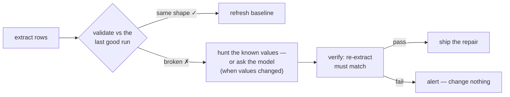

<div align="center">

# 🩹 scrape-heal

**Your scraper breaks when the site redesigns. This fixes itself — or tells you exactly what broke.**

Scrapers have one job, and it falls apart in the most boring way possible: the site renames a class,
moves a `<div>`, and suddenly your 3am cron job extracts *nothing*. Not an error, not a warning —
just an empty spreadsheet you notice a week later.

`scrape-heal` remembers what your data looked like, notices when it stops looking like that, and
repairs its own selectors — **only after proving the repair works on the live page.**

[](LICENSE)
[](https://www.npmjs.com/package/scrape-heal)
[](#)
[](#)
[](#)
[](https://github.com/Swastikbhat-lab/scrape-heal/actions/workflows/ci.yml)

</div>

## The loop



Three moving parts, each boring on purpose:

1. **Detect** — every run validates against a schema: enough items, no empty fields, every known
   value still present. A selector that returns *wrong-shaped* data is treated as broken, because it is.
2. **Heal** — the last good run *is* the ground truth. The healer looks at the live page for elements
   that still contain those exact values and derives new selectors from them. No guessing, no regex
   archaeology: it knows the products are called *"Wireless Mouse"* and *"$24.99"*, so it finds them.
3. **Verify — the load-bearing step** — the candidate config is re-run against the live page, and the
   repair ships only if the schema validates **and** every known item is still there. A healer that
   doesn't verify is just a more confident way to break your data.

## See it happen

The whole story in 24 seconds — healthy run, silent redesign, breakage detected, selectors
healed, verified on the live page:

<div align="center">
  
</div>

On a cadence it becomes a watchdog — cycle after cycle, a red run repairs itself or alerts:

<div align="center">
  
</div>


## Quickstart

Install from npm — no clone needed (Node ≥ 20):

```bash
npm install -g scrape-heal
npx playwright install chromium          # once — the loop drives a real browser
scrape-heal --demo --mutate 6 --interval 5 --cycles 8   # watch it break and heal itself
```

Then point it at something real:

```bash
scrape-heal --init        # writes scraper.config.json — every option, commented
# ... edit url, items, fields ...
scrape-heal               # reads scraper.config.json automatically, zero flags
```

Running from a clone instead? `npm install`, `npx playwright install chromium`,
`npm run demo`, `npm test` — every `npm run *` script maps 1:1 to a `scrape-heal`
command.

## Plug and play

One config file, one command. Every key optional; CLI flags override the file when both are present:

```jsonc
{
  "url": "https://example.com/products",   // what to watch
  "items": ".product-card",                // repeating item container
  "fields": { "name": ".name", "price": ".price" },
  "identityField": "name",                 // identifies one item uniquely
  "minItems": 4,                           // below this = broken
  "intervalSeconds": 300,                  // watchdog cadence
  "rowsFrom": null,                        // or: run any scraper, read JSON/CSV rows
  "writeConfig": "scraper.config.json",    // repaired selectors, written back here
  "onAlert": null,                         // command run on an unhealable red cycle
  "statePath": ".scrape-heal/state.json",
  "llm": { "apiKey": null, "model": "gpt-4o-mini", "baseUrl": null },  // or env SCRAPE_HEAL_LLM_*
  "validator": null                        // path to a JS file exporting your schema check
}
```

## Any scraper, not just Playwright

The loop's contract with your scraper is one sentence: **give me the rows.** JSON, JSON Lines, or
CSV — on stdout or in a file. The scraper that produces them is irrelevant; Playwright is just the
built-in source.

```bash
npm run demo:any     # a deliberately dumb fetch+regex scraper, healed the same way
```

- `--rows-from "<cmd>"` — run the command each cycle, parse stdout (Scrapy, Puppeteer, bs4, anything).
- `--rows-file <path>` — watch a file your existing scraper already writes (a cron dump, a CSV).
- `--url` is only needed for **self-healing** (the browser re-measures the page). Without it the loop
  is a plain detector: it validates and alerts, and refuses to guess at repairs.
- A scraper that **crashes** (non-zero exit, no parseable output) is reported as a scraper failure,
  not a site change — the loop never "heals" a scraper that merely errored.

Copy-paste recipes for **Scrapy**, **Puppeteer**, and a **legacy cron dump** →
**[docs/INTEGRATIONS.md](docs/INTEGRATIONS.md)**.

## Watchdog mode

A single run is a snapshot. On a cadence it becomes a watchdog: **the moment a run goes red, it
either repairs itself or alerts — notifies you the same day, not the day after.**

Each cycle: **extract → validate against the last good run.** Healthy cycles refresh the baseline (so
legit new content is tracked, not treated as breakage). A red cycle is handed to the healer — a
verified repair is shipped *and takes effect immediately*; when nothing can be verified, it says so
loudly and nothing is modified:

```bash
npm run watch -- --demo --mutate 20 --interval 10   # watch the loop heal itself
```

**Exit codes, for schedulers:** `0` when the last cycle ended healthy or self-healed, `1` when it
ended red and unhealed — so cron/CI can fail loudly. `--on-alert "command"` runs something the
moment a cycle goes red (webhook, desktop notification); the one-line summary arrives in the
`SCRAPE_HEAL_ALERT` env var. State persists in `.scrape-heal/state.json`, so a restart resumes the
healed config — no re-detecting, no re-healing.

**Flip-flopping sites cost nothing after the first heal.** Every proven config — the original one
and every verified repair — goes into a mini-ledger (persisted in state). When a cycle goes red,
the loop first tries the remembered configs against the live page; the moment one re-extracts the
same data, it's shipped as a `LEDGER HIT` without re-healing. A site that toggles between markup
versions (A/B rollouts, cached deploys, rollbacks) is healed once and remembered forever after:

```bash
npm run watch -- --demo --mutate-flip 12 --interval 5 --cycles 14   # flip-flop demo
```

## When even the data changes (LLM repair)

Text matching dies the moment the redesign *also changes the values* — nothing on the page equals
a known value anymore, so there is no anchor to hunt. That's the one case where structure has to
carry intent. Point scrape-heal at any OpenAI-compatible endpoint and the healer falls back to
asking the model where each field now lives:

```bash
npm run demo:llm       # keyless: redesign + brand-new values, healed by a mock LLM
npm run watch          # real: set the env vars below (or llm.apiKey in the config)
```

```
SCRAPE_HEAL_LLM_API_KEY=sk-...
SCRAPE_HEAL_LLM_MODEL=gpt-4o-mini
SCRAPE_HEAL_LLM_BASE_URL=https://api.openai.com/v1   # OpenRouter, Groq, Ollama, LM Studio — any /v1/chat/completions
```

The model only **proposes**. The candidate config is still re-run against the live page, and a
proposal that doesn't extract the right shape is refused with the same loud alert as any other
failed repair — a bad model guess is exactly as safe as a bad text guess. When the old values are
gone for real (the data changed), the gate verifies shape honestly — right count, no empty fields
— and says so in the log instead of pretending it verified the data. Propose with the model,
**verify with the browser** — the split stays intact.

## Your schema, your rules (pluggable validators)

The built-in checks are deliberately boring — enough items, no empty fields, same identities.
When you already own a schema, plug it in instead:

```bash
npm run demo:validator    # example: a USD-price rule on top of the shape checks
npm run watch -- --validator my-schema.js
```

`my-schema.js` exports one function:

```js
export default (items, { config, baseline }) => ({
  ok: items.every((it) => /^\$\d/.test(it.price)),   // your rule
  itemCount: items.length,
  issues: [],                                          // filled in when ok is false
});
```

It replaces the built-in shape checks *everywhere* — healthy runs, ledger hits, and the repair
verify gate — so your schema is what "good" means, not a second opinion.

## What it refuses to do

- **Ship unverified repairs.** If the candidate doesn't re-extract the same data, you get a log
  instead of a broken config.
- **Invent data.** The repaired run must contain everything the last good run contained.
- **Trust the model.** An LLM proposal is a proposal; it still has to pass the verify gate.
- **"Heal" a crashed scraper.** A non-zero exit is a scraper bug, not a site change.

## What's next (honestly)

Small by design — one machine, one target, one loop. Shipped so far: the detect → heal → verify
loop, watchdog mode, the any-scraper row contract, the selector ledger for flip-flopping sites,
LLM-assisted repair for when even the values change, and pluggable validators — all covered by
the test suite, all green in CI. What this is *not*: a fleet manager, an anti-bot tool, or a
multi-node production deployment. It is the 99% case, done well. The interesting next steps:

- **LLM repair that learns from its own misses** — feed the failed proposal plus the page it
  failed on back to the model, so per-site selector-writing rules accumulate.
- **Per-target config** — today LLM/validator options are global; a fleet of scrapers would each
  want its own rules and its own repair budget.
- **The anti-detection arms race** is real and this isn't that. This is about the 99% case: markup
  changed, data still there, nobody noticed.

## The point

Scrapers break constantly and silently. The fix isn't better selectors — it's a loop that notices,
repairs, and **proves** the repair. If that loop had existed, the *"Weekly update failed"* issues
that litter GitHub would mostly not exist.

---

<div align="center">

MIT licensed · [issues & ideas welcome](https://github.com/Swastikbhat-lab/scrape-heal/issues) · [contributing](CONTRIBUTING.md)

⭐ Star it if your cron job has ever silently returned nothing.

</div>
