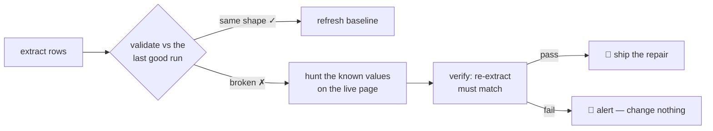

<div align="center">

# 🩹 scrape-heal

**Your scraper breaks when the site redesigns. This fixes itself — or tells you exactly what broke.**

Scrapers have one job, and it falls apart in the most boring way possible: the site renames a class,
moves a `<div>`, and suddenly your 3am cron job extracts *nothing*. Not an error, not a warning —
just an empty spreadsheet you notice a week later.

`scrape-heal` remembers what your data looked like, notices when it stops looking like that, and
repairs its own selectors — **only after proving the repair works on the live page.**

[](#)
[](#)
[](#)
[](#)
[](#)

</div>

## The loop



Three moving parts, each boring on purpose:

1. **Detect** — every run validates against a schema: enough items, no empty fields, every known
   value still present. A selector that returns *wrong-shaped* data is treated as broken, because it is.
2. **Heal** — the last good run *is* the ground truth. The healer looks at the live page for elements
   that still contain those exact values and derives new selectors from them. No guessing, no regex
   archaeology: it knows the products are called *"Wireless Mouse"* and *"$24.99"*, so it finds them.
3. **Verify — the load-bearing step** — the candidate config is re-run against the live page, and the
   repair ships only if the schema validates **and** every known item is still there. A healer that
   doesn't verify is just a more confident way to break your data.

## See it happen

| One run: detect → heal → verify | On a cadence: the watchdog |
| :---: | :---: |
|  |  |

*(Both GIFs are generated, not recorded — `npm run make:gifs` re-renders them from the same
transcripts whenever the story changes. No OBS, no ffmpeg.)*

## Quickstart

```bash
npm install
npx playwright install chromium
npm run demo        # watch the full break-and-recover cycle
```

Then point it at something real:

```bash
npm run init        # writes scraper.config.json — every option, commented
# ... edit url, items, fields ...
npm run watch       # reads scraper.config.json automatically, zero flags
```

## Plug and play

One config file, one command. Every key optional; CLI flags override the file when both are present:

```jsonc
{
  "url": "https://example.com/products",   // what to watch
  "items": ".product-card",                // repeating item container
  "fields": { "name": ".name", "price": ".price" },
  "identityField": "name",                 // identifies one item uniquely
  "minItems": 4,                           // below this = broken
  "intervalSeconds": 300,                  // watchdog cadence
  "rowsFrom": null,                        // or: run any scraper, read JSON/CSV rows
  "writeConfig": "scraper.config.json",    // repaired selectors, written back here
  "onAlert": null,                         // command run on an unhealable red cycle
  "statePath": ".scrape-heal/state.json"
}
```

## Any scraper, not just Playwright

The loop's contract with your scraper is one sentence: **give me the rows.** JSON, JSON Lines, or
CSV — on stdout or in a file. The scraper that produces them is irrelevant; Playwright is just the
built-in source.

```bash
npm run demo:any     # a deliberately dumb fetch+regex scraper, healed the same way
```

- `--rows-from "<cmd>"` — run the command each cycle, parse stdout (Scrapy, Puppeteer, bs4, anything).
- `--rows-file <path>` — watch a file your existing scraper already writes (a cron dump, a CSV).
- `--url` is only needed for **self-healing** (the browser re-measures the page). Without it the loop
  is a plain detector: it validates and alerts, and refuses to guess at repairs.
- A scraper that **crashes** (non-zero exit, no parseable output) is reported as a scraper failure,
  not a site change — the loop never "heals" a scraper that merely errored.

Copy-paste recipes for **Scrapy**, **Puppeteer**, and a **legacy cron dump** →
**[docs/INTEGRATIONS.md](docs/INTEGRATIONS.md)**.

## Watchdog mode

A single run is a snapshot. On a cadence it becomes a watchdog: **the moment a run goes red, it
either repairs itself or alerts — notifies you the same day, not the day after.**

Each cycle: **extract → validate against the last good run.** Healthy cycles refresh the baseline (so
legit new content is tracked, not treated as breakage). A red cycle is handed to the healer — a
verified repair is shipped *and takes effect immediately*; when nothing can be verified, it says so
loudly and nothing is modified:

```bash
npm run watch -- --demo --mutate 20 --interval 10   # watch the loop heal itself
```

**Exit codes, for schedulers:** `0` when the last cycle ended healthy or self-healed, `1` when it
ended red and unhealed — so cron/CI can fail loudly. `--on-alert "command"` runs something the
moment a cycle goes red (webhook, desktop notification); the one-line summary arrives in the
`SCRAPE_HEAL_ALERT` env var. State persists in `.scrape-heal/state.json`, so a restart resumes the
healed config — no re-detecting, no re-healing.

## What it refuses to do

- **Ship unverified repairs.** If the candidate doesn't re-extract the same data, you get a log
  instead of a broken config.
- **Invent data.** The repaired run must contain everything the last good run contained.
- **"Heal" a crashed scraper.** A non-zero exit is a scraper bug, not a site change.

## What's next (honestly)

This is a PoC, deliberately small. The interesting next steps:

- **LLM-assisted repair** for selectors whose *values* changed too (then you must infer intent from
  structure, not text).
- **Remembering healed configs** — a mini-ledger of previously-proven selectors, so a site that
  flip-flops between markup versions stops being re-healed every cycle.
- **Pluggable validators** — use the schema you already own instead of the built-in shape checks.
- **The anti-detection arms race** is real and this isn't that. This is about the 99% case: markup
  changed, data still there, nobody noticed.

## The point

Scrapers break constantly and silently. The fix isn't better selectors — it's a loop that notices,
repairs, and **proves** the repair. If that loop had existed, the *"Weekly update failed"* issues
that litter GitHub would mostly not exist.

---

<div align="center">

 MIT licensed · [issues & ideas welcome](https://github.com/Swastikbhat-lab/scrape-heal/issues)

⭐ Star it if your cron job has ever silently returned nothing.

</div>
